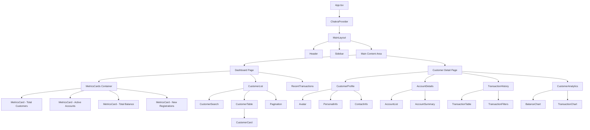
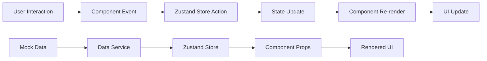
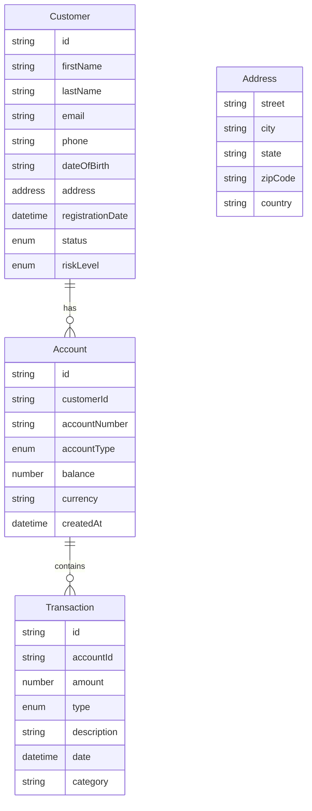
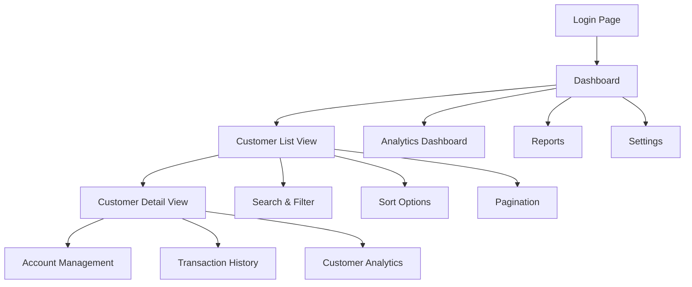
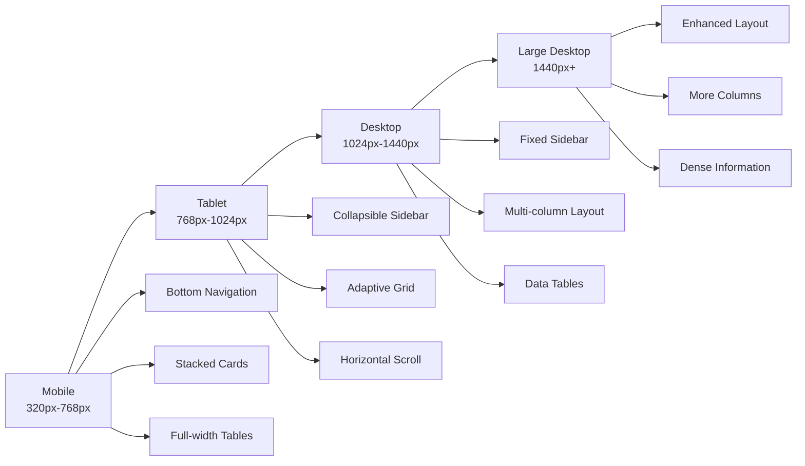

# Bank UI Component Hierarchy & Data Flow

## Application Component Tree

```mermaid
graph TD
    A[App.tsx] --> B[ChakraProvider]
    B --> C[MainLayout]
    C --> D[Header]
    C --> E[Sidebar]
    C --> F[Main Content Area]

    F --> G[Dashboard Page]
    F --> H[Customer Detail Page]

    G --> I[MetricsCards Container]
    G --> J[CustomerList]
    G --> K[RecentTransactions]

    I --> L[MetricsCard - Total Customers]
    I --> M[MetricsCard - Active Accounts]
    I --> N[MetricsCard - Total Balance]
    I --> O[MetricsCard - New Registrations]

    J --> P[CustomerSearch]
    J --> Q[CustomerTable]
    J --> R[Pagination]

    Q --> S[CustomerCard]

    H --> T[CustomerProfile]
    H --> U[AccountDetails]
    H --> V[TransactionHistory]
    H --> W[CustomerAnalytics]

    T --> X[Avatar]
    T --> Y[PersonalInfo]
    T --> Z[ContactInfo]

    U --> AA[AccountList]
    U --> BB[AccountSummary]

    V --> CC[TransactionTable]
    V --> DD[TransactionFilters]

    W --> EE[BalanceChart]
    W --> FF[TransactionChart]
```

## State Management Flow

```mermaid
graph LR
    A[User Interaction] --> B[Component Event]
    B --> C[Zustand Store Action]
    C --> D[State Update]
    D --> E[Component Re-render]
    E --> F[UI Update]

    G[Mock Data] --> H[Data Service]
    H --> I[Zustand Store]
    I --> J[Component Props]
    J --> K[Rendered UI]
```

## Data Model Relationships

```mermaid
erDiagram
    Customer ||--o{ Account : has
    Account ||--o{ Transaction : contains
    Customer {
        string id
        string firstName
        string lastName
        string email
        string phone
        string dateOfBirth
        address address
        datetime registrationDate
        enum status
        enum riskLevel
    }
    Account {
        string id
        string customerId
        string accountNumber
        enum accountType
        number balance
        string currency
        datetime createdAt
    }
    Transaction {
        string id
        string accountId
        number amount
        enum type
        string description
        datetime date
        string category
    }
    Address {
        string street
        string city
        string state
        string zipCode
        string country
    }
```

## Page Flow & Navigation

```mermaid
graph TD
    A[Login Page] --> B[Dashboard]
    B --> C[Customer List View]
    C --> D[Customer Detail View]
    D --> E[Account Management]
    D --> F[Transaction History]
    D --> G[Customer Analytics]

    B --> H[Analytics Dashboard]
    B --> I[Reports]
    B --> J[Settings]

    C --> K[Search & Filter]
    C --> L[Sort Options]
    C --> M[Pagination]
```

## Responsive Breakpoints

```mermaid
graph LR
    A[Mobile<br/>320px-768px] --> B[Tablet<br/>768px-1024px]
    B --> C[Desktop<br/>1024px-1440px]
    C --> D[Large Desktop<br/>1440px+]

    A --> A1[Bottom Navigation]
    A --> A2[Stacked Cards]
    A --> A3[Full-width Tables]

    B --> B1[Collapsible Sidebar]
    B --> B2[Adaptive Grid]
    B --> B3[Horizontal Scroll]

    C --> C1[Fixed Sidebar]
    C --> C2[Multi-column Layout]
    C --> C3[Data Tables]

    D --> D1[Enhanced Layout]
    D --> D2[More Columns]
    D --> D3[Dense Information]
```
